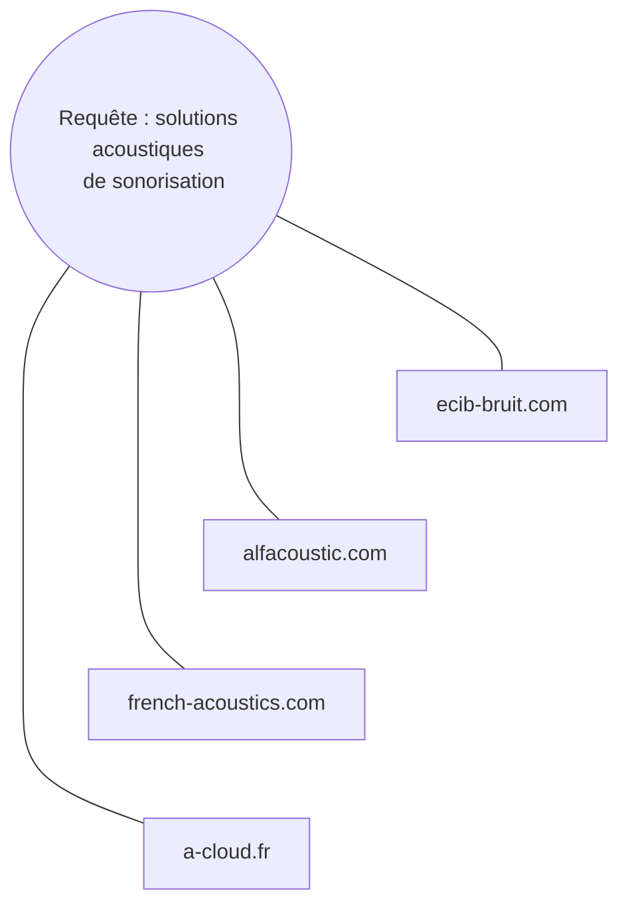

# 🚀 Test Technique – **“Context Lens”**

## 1. Contexte

Votre mission chez **DARYL** est d’aider les équipes commerciales de l’industrie à décider rapidement si un nouveau projet client est “dans le scope” ou non.
Les ingénieurs IA ont déjà :

1. un pipeline LLM + RAG qui résume les briefs ;
2. une clé **Tavily Search API** pour chercher des infos web fraîches.

Les commerciaux réclament maintenant une **vue graphique instantanée** :

> « Si je tape *“solutions acoustiques de sonorisation”*, je veux tout de suite une carte des fournisseurs, brevets et actus. »

Vous allez donc créer le premier module **“Context Lens”** qui produit et affiche ce graphe.

---

## 2. Objectif pratique

Construire un mini-service qui :

1. reçoit une requête `query`,
2. appelle Tavily pour obtenir des résultats web,
3. transforme ces résultats en **graphe JSON léger**,
4. renvoie **à la fois** ce JSON **et** un **Web Component** autonome qui affiche ce graphe, prêt à être inclus n’importe où.

---

## 3. Livrables attendus

| Partie                                | Exigences principales                                                                                                                                                                                                                                                                                                                                                              |
| ------------------------------------- | ---------------------------------------------------------------------------------------------------------------------------------------------------------------------------------------------------------------------------------------------------------------------------------------------------------------------------------------------------------------------------------- |
| **Back-end (Node + TypeScript)**      | *Route* `GET /api/graph?query=<q>` → répond :<br>`{ graph: {nodes, edges}, componentUrl: "/components/result-graph.js" }`<br>• Construction du graphe :<br>  – nœud central = la requête ;<br>  – un nœud par résultat Tavily, arête “query → résultat”.<br>• Cache (mémoire ou Redis) 15 min par requête identique.<br>• Gestion d’erreurs propre (400 params, 503 quota Tavily). |
| **Web Component (`result-graph`)**    | • ES-module vanilla ou **Lit**.<br>• Prop/attr `data` recevant le JSON du graphe.<br>• Rendu force-directed via **D3.js** ou **vis-network**.<br>• Hover : titre + URL ; click : `window.open(url)`.                                                                                                                                                                               |
| **Démo front (React ou HTML simple)** | Barre de recherche → appelle `/api/graph` → importe dynamiquement `/components/result-graph.js` puis :<br>`<result-graph data-endpoint="…"></result-graph>`                                                                                                                                                                                                                        |
| **Qualité projet**                    | • TypeScript strict partout.<br>• Tests unitaires (builder, cache) + 1 test E2E (Playwright/Cypress).<br>• `docker-compose up` démarre API, cache, serveur statique.<br>• README clair (+ diagramme simple).                                                                                                                                                                       |

#### exemple d'illustration du graph:


---

## 4. Critères d’évaluation (100 pts + 10 bonus)

| Catégorie            | Pts | Ce qu’on regarde                             |
| -------------------- | --- | -------------------------------------------- |
| API correcte & cache | 25  | Réponse conforme, HTTP clean, quota respecté |
| Qualité du graphe    | 20  | Modèle pertinent, extensible                 |
| Web Component & UX   | 20  | Encapsulation, interactivité fluide          |
| Code & tests         | 15  | Lisibilité, types, couverture ≥ 80 % builder |
| Doc & DX             | 10  | Setup 1 commande, README utile               |
| Perf & sécurité      | 10  | Helmet/CORS, rate-limit, async I/O           |
| Bonus                | +10 | Élégance, features extra                     |

---

## 5. Ressources fournies

* **Clé Tavily** (dans `.env`, variable `TAVILY_API_KEY`). Voici le lien du secret [https://vault.bitwarden.eu/#/send/ol32tSm6rE2jArMHAI32Tg/fuQ-hP4dnAPH5C1Wc03s2w](https://vault.bitwarden.eu/#/send/ol32tSm6rE2jArMHAI32Tg/fuQ-hP4dnAPH5C1Wc03s2w) ( copier et coller dans votre `.env` )
* Palette de couleurs et logo (optionnel).
   - #6366F1
   - #FFFFFF
   - lien logo : [https://daryl-ai.com/wp-content/uploads/2025/04/DARYL_hwt.png](https://daryl-ai.com/wp-content/uploads/2025/04/DARYL_hwt.png)

Docs Tavily : [https://api.tavily.com](https://api.tavily.com) (endpoint recherche : `/search`).

---

## 6. Modalités

* **Charge estimée :** 6–8 h effectives.
* **Délai :** 5 jours calendaires après réception de la clé.
* Prévenez-nous si un empêchement survient.

---

## 7. Comment nous testerons

```bash
git clone <votre-repo>
cp .env.example .env   # ajoutez la clé
docker-compose up -d
npm run e2e
open http://localhost:3000
```

L’équipe ouvrira la démo, tapera
`solutions acoustiques de sonorisation`
et devra voir un graphe ≤ 15 nœuds chargé en < 3 s.

---

### Bonne chance ! Nous avons hâte de découvrir votre “Context Lens”.
#### DES QUESTIONS ? --> [ilyas@daryl-ai.com](ilyas@daryl-ai.com)
